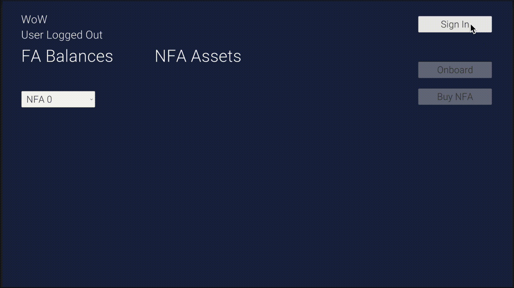

# FinalBiome Unity Playground

The Playground of the [FinalBiome Unity](https://github.com/finalbiome/finalbiome-unity) project to play with FinalBiome.

The project includes a minimal UI that demonstrates the capabilities of the client and how to interact with the FinalBiome Network.

### Features
* Sing Up / Sign In
* Reading NFA properties from the network state of the example game configuration.
* Executing the Onboard mechanics to obtaining a starter pack of assets
* Exec the Buy mechanics to buy selected NFA



## Usage

This project requires a locally running FinalBiome [node](https://github.com/finalbiome/finalbiome-node) with imported [./game_spec_wow.json](./game_spec_wow.json) spec:
```sh
finalbiome-impex import -g game_spec_wow.json -s 0x786ad0e2df456fe43dd1f91ebca22e235bc162e0bb8d53c633e8c85b2af68b7a -m 0x42438b7883391c05512a938e36c2df0131e088b3756d6aa7a755fbff19d2f842
``` 

## License

This project is licensed under the [MIT License](./LICENSE).
